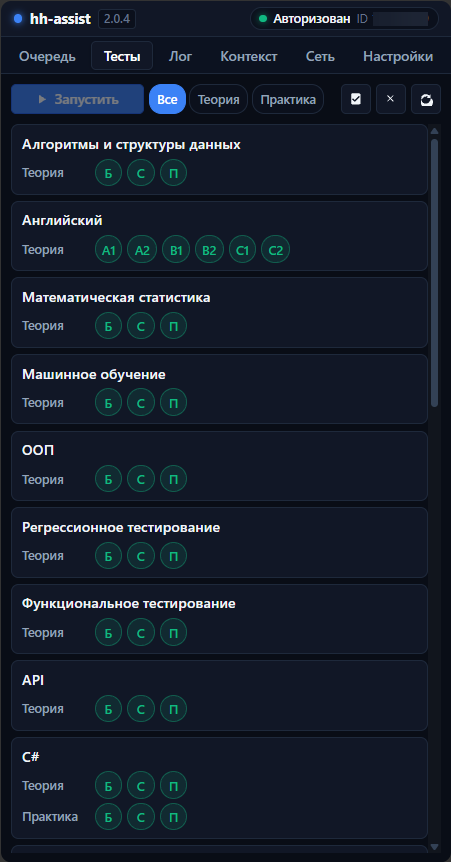
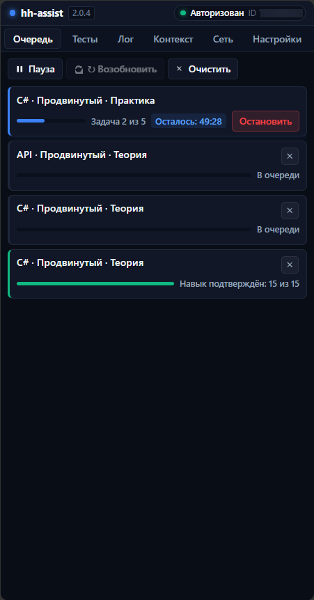

# hh-assist

<p align="center">
  
</p>

<p align="center">
  <strong>Автоматизированное решение сертификационных тестов с помощью нейросетей для assessment.hh.ru</strong>
</p>

<p align="center">
  
  
  
  
  
</p>

---

## Что это такое

**hh-assist** — расширение для браузера Chrome (Manifest V3), которое встраивается в боковую панель браузера и автоматизирует решение сертификационных тестов (теоретических и практических заданий) на платформе [assessment.hh.ru](https://assessment.hh.ru/).

Работает **полностью по API** через официальный backend: каталог и задачи считываются из SSR, цикл «вопрос → LLM → ответ» выполняется через эндпоинты `/shards/*`, а телеметрия контролируется расширением. Все операции выполняются в **одной вкладке**.

<p align="center">
  
  
</p>

---

## Архитектура и принципы

```text
┌─────────────────────────────────┐               ┌────────── MV3 Service Worker (background.js) ──────────┐
│ Side Panel (React 19 + Zustand) │ ◄────RPC────► │ Coordinator (очередь, запуск, keep-alive)              │
└─────────────────────────────────┘               │  ├── Fingerprint: синтетический профиль                │
                                                  │  ├── Единая вкладка: каталог → тест → каталог          │
                                                  │  └── Solvers (теория / практика) → LLM API             │
                                                  └────────────────────────────────────────────────────────┘
```

- **Одна вкладка на всё:** Все действия (каталог, редирект на тест, возврат) происходят в одной вкладке на `hh.ru` и любых региональных доменах.
- **Работа по API:** Решение задач идет через прямые вызовы `/shards/*` из контекста страницы без эмуляции кликов в DOM.
- **Синтетический Fingerprint:** Автоматическая генерация и кэширование валидного профиля окружения (`visitorId`, `xhh`, хэши).
- **Натуральная телеметрия:** Шлюз телеметрии (`telemetry-gate.js`) транслирует валидные события активности (type 5, 8, 10) и скрывает артефакты автоматизации.
- **Отказоустойчивость:** Предтест-проверка доступности LLM, автоматическая пауза при сбоях API и сохранение состояния сессии при выгрузке Service Worker.
- **100% TypeScript:** Весь проект (бэкенд, сервис-воркер, солверы, промпты, ядро и интерфейс) полностью написан на **TypeScript** со строгой статической типизацией.
- **Современный UI стейт:** Интерфейс боковой панели реализован на **React 19 + TypeScript + Vite + Zustand** с полной изоляцией от бэкенда и соблюдением строгой CSP Manifest V3.

---

## Структура проекта

```text
hh-assist/
├── dist/               — скомпилированное готовое расширение (Manifest V3)
│   ├── manifest.json   — манифест расширения
│   ├── background.js   — бандл фонового сервис-воркера
│   ├── panel/          — скомпилированный UI боковой панели (HTML, JS, CSS)
│   └── assets/         — иконки расширения (16, 32, 48, 128)
├── src/
│   ├── background/     — координатор тестов, очередь, логирование, вкладки и keep-alive
│   ├── core/           — API-клиент, протокол, fingerprint, телеметрия, LLM-клиент, тайминги
│   ├── solvers/        — логика решения теории (TheorySolver) и практики (PracticeSolver)
│   ├── prompts/        — системные промпты, сборщики контекста задач и stripCodeFence
│   ├── types/          — единые интерфейсы протокола, настроек, фингерпринта и DTO
│   └── panel/          — исходники UI боковой панели (React 19, TypeScript, Zustand)
├── tests/              — 32 тестовых сьюта, 294 юнит- и интеграционных теста (Vitest)
├── manifest.json       — мастер-манифест расширения (Manifest V3)
├── vite.config.ts      — конфигурация сборщика Vite
└── tsconfig.json       — настройки компилятора TypeScript
```

---

## Вкладки панели управления

- **Очередь:** Управление запуском (`Пауза`, `Возобновить`, `Очистить`), карточки активных задач с прогрессом и таймером.
- **Тесты:** Каталог навыков с уровнями сложности (Базовый, Средний, Продвинутый), фильтрами и пакетным запуском.
- **Лог:** Журнал событий в реальном времени с фильтрацией по категориям (`Инфо`, `Варнинги`, `Ошибки`), копированием и очисткой.
- **Контекст:** Инспектор диалогов с LLM (системный промпт, задание, ответ модели, история попыток).
- **Сеть:** Встроенный рекордер сетевого трафика для отладки сессий тестирования с выгрузкой JSON-дампов.
- **Настройки:** Конфигурация провайдеров LLM (OpenAI, OpenRouter, OpenCode Zen, DeepSeek, Groq, Mistral AI, Ollama, vLLM, Custom), выбор моделей, настройка таймингов и профилей fingerprint.

---

## Рекомендации

- **Выбор модели:** Для безошибочного прохождения тестов (особенно сложных практических задач с многошаговым self-repair) рекомендуется использовать минимум **GPT 5.6 Luna** с **максимальным уровнем reasoning** (`max` / `high`). Это гарантирует корректный анализ условий задач, точное соблюдение контрактов ответов без изменения сигнатур и успешное прохождение всех проверочных smoke-тестов.
- **Подключение:** Рекомендуется использовать проверенные провайдеры с минимальной задержкой и стабильным каналом (OpenCode Zen, OpenRouter или прямой API OpenAI).

---

## Установка и запуск

### Вариант 1. Установка из готового релиза (Рекомендуется)

1. Перейдите на страницу **[GitHub Releases](https://github.com/CriDos/hh-assist/releases)** и скачайте zip-архив актуального релиза (файл вида `hh-assist-v*.zip`).
2. Распакуйте скачанный zip-архив в любую удобную папку на компьютере.
3. Откройте в браузере страницу расширений: `chrome://extensions/` *(или меню Chrome → «Расширения» → «Управление расширениями»)*.
4. В правом верхнем углу включите переключатель **«Режим разработчика»** (*Developer mode*).
5. В левом верхнем углу нажмите кнопку **«Загрузить распакованное расширение»** (*Load unpacked*).
6. В появившемся окне выберите папку, в которую вы распаковали архив (папку с файлом `manifest.json`).
7. Закрепите значок `hh-assist` на панели расширений Chrome и нажмите на него — справа откроется боковая панель управления (Side Panel).

---

### Вариант 2. Сборка из исходного кода (для разработки)

1. Клонируйте репозиторий и установите зависимости:
   ```bash
   git clone https://github.com/CriDos/hh-assist.git
   cd hh-assist
   npm install
   ```
2. Соберите проект:
   ```bash
   npm run build
   ```
3. Скомпилированные файлы появятся в директории **`dist/`**.
4. В `chrome://extensions/` нажмите **«Загрузить распакованное расширение»** и укажите папку **`dist/`**.

> **Разработка фронтенда панели (HMR):**
> Для интерактивной разработки интерфейса Side Panel с автообновлением доступна команда `npm run dev:panel`.

---

## Тестирование и форматирование

В проекте используется тестовый фреймворк **Vitest** (32 сьюта, 294 теста):

```bash
# Проверка строгой статической типизации
npm run typecheck

# Запуск полного набора юнит- и интеграционных тестов
npm test

# Форматирование исходного кода с помощью Prettier
npm run format
```

---

## Безопасность

- Ключи API хранятся локально в `chrome.storage.local` и не передаются наружу.
- Нет `web_accessible_resources` — внутренние файлы расширения недоступны для скриптов страниц.
- Изолированный шлюз телеметрии гарантирует сохранение нативного формата запросов.
- Сборка панели генерирует статический бандл без использования `eval()` и inline-скриптов (100% соответствие Content Security Policy).

---

## Лицензия

Проект распространяется под открытой лицензией [MIT](LICENSE).